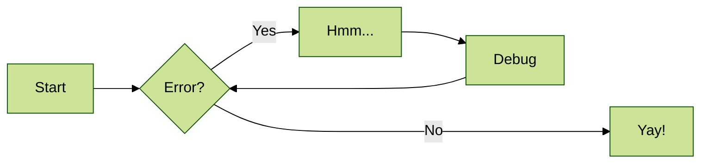

# efidemos/sample-react-app TechDocs

## What is this?

This is a placeholder TechDocs page. Here you will write your technical documentation for your software. This supports markdown, so get styling!

## Some Cool Features

### Mermaid Diagrams

### Additional Reading

- [MKDocs: Writing your docs](https://www.mkdocs.org/user-guide/writing-your-docs/)
- [Python Markdown](https://python-markdown.github.io/)